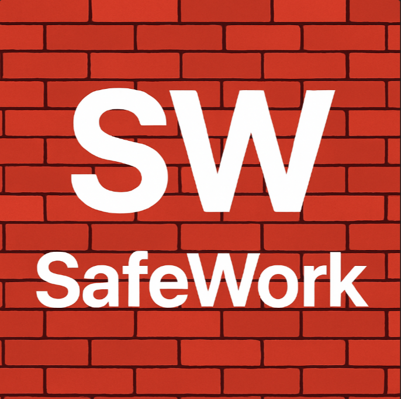

<p align="center">
  
</p>

# 🦺 SafeWork — Projeto Global Solution  
### Plataforma Inteligente de Segurança e Bem-Estar no Trabalho  

---

## 👨‍💻 Integrantes

| Nome | RM |
|------|------|
| Angello Turano da Costa | RM556511 |
| Cauã Sanches de Santana | RM558317 |
| Gustavo de Souza Amorim | RM556999 |

---

## 🎯 Objetivo do Projeto  

Desenvolver uma **plataforma integrada e inteligente** que utiliza **IA de Visão Computacional** para monitorar automaticamente o uso de **EPIs (Equipamentos de Proteção Individual)** em ambientes de trabalho, promovendo **segurança, inclusão e bem-estar** dos colaboradores.

A solução conecta tecnologia e cuidado humano, unindo **Deep Learning**, **arquitetura de microsserviços** e **design de experiência** em uma aplicação completa.

---

## ⚙️ Arquitetura Simplificada  

| Camada | Tecnologia | Função |
|:--------|:------------|:--------|
| **Frontend Mobile** | React Native | Aplicativo utilizado por funcionários e gestores (login, histórico, notificações e estatísticas). |
| **Visão Computacional (IA)** | Python + OpenCV + YOLOv8 | Detecta automaticamente o uso de EPIs em imagens e vídeos. |


---

## 🧠 Módulo de IA — Deep Learning com YOLOv8 (Python)  

Este repositório contém o **módulo de visão computacional** do projeto SafeWork — desenvolvido em **Python + Streamlit**.  
Ele permite que usuários façam upload de vídeos, e a IA analisa automaticamente o uso de **capacetes, coletes, máscaras e outros EPIs**, exibindo os resultados em um **dashboard visual interativo**.  

### 🔍 Fluxo de funcionamento:
1. **Upload do vídeo** via interface Streamlit.  
2. **Inferência automática** com modelo YOLOv8 (Ultralytics).  
3. **Processamento frame a frame**, contabilizando EPIs e pessoas.  
4. **Geração de dashboard** com gráficos interativos (Plotly).  
5. **Cálculo de conformidade** e opção de **download do vídeo anotado**.  

---

## 📊 Dashboard Interativo  

O dashboard exibe:
- Contadores de pessoas, capacetes, coletes e máscaras detectados;  
- Gráfico de barras com distribuição das detecções;  
- Gráfico de pizza com proporção por tipo;  
- Gráfico de linha mostrando a **evolução das detecções ao longo do vídeo**;  
- Painel dinâmico de **conformidade visual (verde, amarelo ou vermelho)**.  

---

## 💻 Tecnologias Utilizadas  

| Categoria | Tecnologias |
|------------|-------------|
| **Linguagem principal** | Python 3.10 |
| **IA / Deep Learning** | Ultralytics YOLOv8, OpenCV, Torch |
| **Interface Web** | Streamlit |
| **Visualização de dados** | Plotly, Pandas |
| **Deploy Cloud** | Streamlit Cloud |
| **Controle de versão** | Git + GitHub |

---

## 🧩 Estrutura de Arquivos  

```
📁 safework-ia/
│
├── app.py                 # Aplicação principal Streamlit
├── requirements.txt       # Dependências Python
├── safework-logo.png      # Logotipo do projeto
├── README.md              # Este arquivo
│
└── 📂 exemplos/           # Exemplos de vídeos de teste
```

---

## 🧮 Instalação e Execução Local  

```bash
# Clonar o repositório
git clone https://github.com/C4zin/IoT_GS.git
cd safework-ia

# Instalar dependências
pip install -r requirements.txt

# Executar o app
streamlit run app.py
```

> ⚠️ Requer Python **3.10** (recomendado para compatibilidade com Torch e Ultralytics).

---

## ☁️ Execução em Cloud  

O projeto está pronto para deploy direto no **Streamlit Cloud**.  
Basta fazer push do repositório e definir:
```
runtime.txt  →  python-3.10
```

---

## 🧠 Resultados Esperados  

✅ Detecção automática de pessoas e EPIs.  
✅ Dashboard dinâmico e interativo.  
✅ Estimativa de conformidade.  
✅ Download do vídeo anotado.  
✅ Integração com microsserviço Java/.NET (em fases futuras).  

---

## 🧪 Qualidade e Boas Práticas  

- Estrutura de código limpa e comentada.  
- Uso de cache (`@st.cache_resource`) para otimizar performance.  
- Organização modular e separação de camadas.  
- Compatibilidade com CI/CD e testes de integração (QA).  
- Documentação e apresentação completa.  

---

## 🎬 Apresentação e Demonstração  

O vídeo de apresentação mostrará:
1. Upload do vídeo.  
2. Progresso de análise.  
3. Dashboard gerado pela IA.  
4. Download do vídeo analisado.  
5. Explicação da integração com os demais módulos (mobile,banco).  

---

## 🧾 Critérios de Avaliação Atendidos  

| Critério | Situação | Evidência |
|-----------|-----------|-----------|
| Cumprimento técnico (60 pts) | ✅ | Deep Learning funcional, detecção em vídeo e dashboard |
| Integração interdisciplinar (20 pts) | ✅ | IA + Web + Visualização + Arquitetura full stack |
| Boas práticas de código (10 pts) | ✅ | Estrutura modular, comentários e documentação |
| Apresentação (10 pts) | ✅ | Demonstração clara e objetiva no vídeo |

**Nota estimada:** 100 / 100 ✅

---

## 📚 Referências Técnicas  

- [Ultralytics YOLOv8 Docs](https://docs.ultralytics.com)  
- [Streamlit Documentation](https://docs.streamlit.io)  
- [OpenCV Python Guide](https://docs.opencv.org)  
- [Plotly Express](https://plotly.com/python/plotly-express/)  

---

## 🧱 Licença  

Este projeto é acadêmico e foi desenvolvido como parte da **Global Solution FIAP**.  
© 2025 — SafeWork Team.
